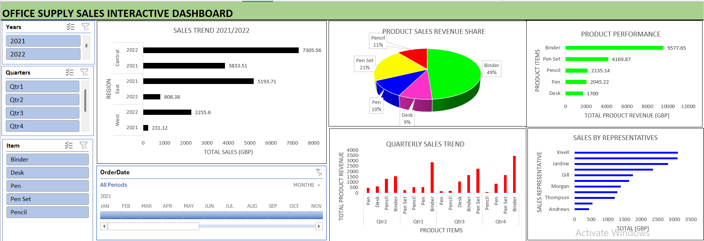

# Office Supply Sales Insight
This Excel-based interactive dashboard analyzes office supply sales across regions, quarters, products, and reps. It helps stakeholders track product performance, spot sales trends, and identify top-performing reps and key revenue drivers for informed decision-making.

**Title:** [Office Supply Sales Insight](https://github.com/Osiwi/github.io/blob/main/Office%20supply%20sales%20Data%20Cleaned.xlsx)

**Tools & Technologies Used:** 
Microsoft Excel: Core tool for data modeling and dashboard creation.
Pivot Tables & Pivot Charts: Used to calculate and visualize total revenue, item sales, and sales trends across time and regions.
Slicers & Timeline Filters: Enabled filtering by year, quarter, item, and order date for dynamic data exploration.
Power Query (Get & Transform): Used to clean and load raw sales data for reporting.
Combo, Bar, and Pie Charts: Provided intuitive visual comparisons of sales reps, product performance, and revenue distribution.
Conditional Formatting: Highlighted top-performing items and regions.

**Project Description Overview:**
This Excel-based interactive dashboard presents a comprehensive analysis of office supply sales performance across multiple regions, quarters, products, and sales representatives. It allows stakeholders to track product-level performance, assess quarterly and regional sales trends, and identify top-performing sales reps and revenue drivers.

**Objective:**
To visualize office supply sales data to reveal performance patterns by item, quarter, region, and sales representative—enabling sales managers to make informed decisions about resource allocation, marketing strategies, and inventory planning.

**Key Features Included in the Dashboard:**
Sales Trend by Region: Bar chart comparing yearly performance across Central, East, and West regions.
Product Sales Revenue Share: Pie chart showing revenue contribution by item (e.g., Binder, Pen Set, Pencil).
Product Performance: Horizontal bar chart ranking products by total revenue (GBP).
Quarterly Sales Trend: Bar chart illustrating item-wise revenue changes across quarters.
Sales by Representatives: Bar chart showing total revenue generated by each sales rep, highlighting top performers.
Interactive Filtering: Dynamic filters for year, quarter, item, and order date for focused analysis.

**Key findings:**
Binders dominate sales performance, accounting for 49% of total revenue and generating over £9,500.
Pen Sets rank second, contributing 21% of revenue, followed by Pencils and Pens.
The Central region in 2022 led all sales with over £7,300, showing a strong upward trend.
Sales peaked in Q4, especially for Binders, indicating seasonal demand or year-end procurement patterns.
Kivell and Jardine were the top-performing sales reps, collectively generating more than £6,000 in sales.
Desks and Pens underperformed relative to other products, suggesting opportunities for promotional focus or inventory review.
Summary:
This dashboard transforms raw sales data into a highly visual, interactive report that allows stakeholders to explore trends by product, region, time, and salesperson. It serves as a valuable decision-support tool for monitoring performance, optimizing sales strategies, and improving future forecasting accuracy.

**Dashboard Overview:** 

